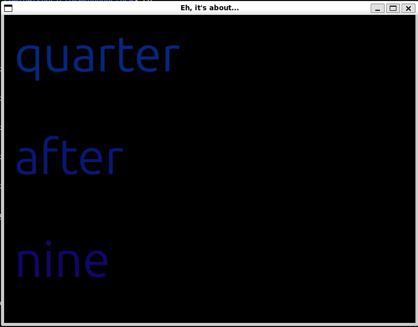

# CloseEnoughClock

I've always been fascinated by time, and by the different ways it can be represented.  Nixie clocks, binary clocks, jump hours, pretty much anything in the whole [TokyoFlash](http://www.tokyoflash.com) assortment...

But I realized something a while ago.  When someone asks us the time, we don't necessarily give them the _right_ answer, we give them an answer that's _close enough_.

So I give you this:

## CloseEnoughClock

A clock that's accurately inaccurate by design.  If someone asks you what time it is, and you see it's 6:44, you could say that - but there's a chance you'd say "it's about a quarter to seven" instead.

CloseEnoughClock is built on this principle - yes, it'll be exactly right on occasion, but every other time it will round off to the nearest 5 minutes.

Does this serve any actual purpose?  Not at all, other than to beat pygame into submission since I had trouble with it in an earlier course. :-)  But let's face it... not all software has to serve a real purpose, right? 

###### ...right?

## Requirements

This clock only requires pygame to be installed - all other packages used are, to my knowledge, part of a standard python installation.
Directions for Pip, substitute as needed for your package manager of choice:

<code> pip install pygame==2.6.1 </code>

After that, clone the repository:

<code>git clone https://github.com/belsonc/CloseEnoughClock</code>

Switch to the directory and run main.py - nothing else to do.

### Purpose
This is an entry for the 2025 [boot.dev](http://boot.dev) hackathon, Amateur division.  It's also to prove to myself that I can take the idea, create it, and get it running in a language that has frustrated me for years.

### Dedication
This project goes out to my beautiful wife Laura, without the support of whom I wouldn't be where I am right now.
To my late cat Charlie, my best friend - go get those churus, duder.  We miss you over here.

